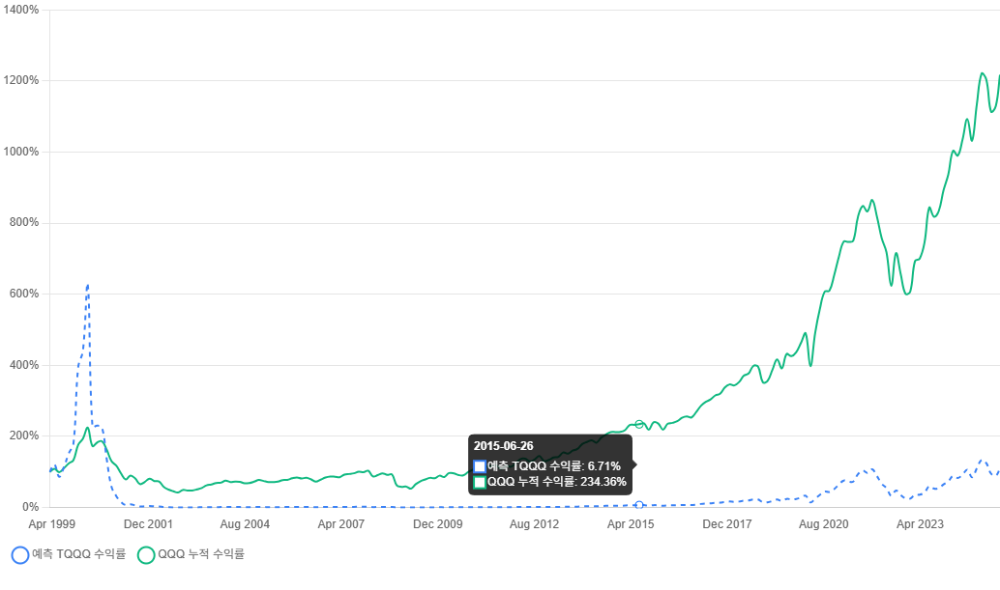

# Leverage Analyzer

A web-based dashboard application that visualizes the prediction model for TQQQ's actual leverage ratio. 
It utilizes a deep learning model trained in [LeverageGenerator](https://github.com/Lacri1/LeverageGenerator) to calculate and visualize TQQQ's expected returns, even for periods before TQQQ's inception.


## Screenshot



## Key Features

- **Custom Date Range Analysis**: Analyze data from March 10, 1999 (QQQ listing date) to present
- **Backtesting Capability**: Simulate TQQQ performance for periods before its actual inception (February 9, 2010)
- **Real-time Predictions**: Predict TQQQ leverage ratios using a trained deep learning model
- **Visualization**: Compare actual TQQQ returns with predicted returns through interactive charts
- **Responsive Design**: Optimized UI/UX for both desktop and mobile environments
- **Historical Simulation**: Understand how TQQQ would have performed during major market events before its launch

## Technology Stack

- **Backend**: Python Flask
- **Frontend**: HTML5, CSS3, JavaScript (Chart.js)
- **Data Processing**: pandas, numpy
- **Machine Learning**: TensorFlow, scikit-learn

## Installation

1. Clone the repository:
```bash
git clone https://github.com/Lacri1/tqqq-leverage-analyzer.git
cd tqqq-leverage-analyzer
```

2. Create and activate a virtual environment:
```bash
python -m venv .venv
.venv\Scripts\activate  # Windows
# or
source .venv/bin/activate  # macOS/Linux
```

3. Install dependencies:
```bash
pip install -r requirements.txt
```

4. Run the application:
```bash
python main.py
```

5. Access in your web browser:
```
http://127.0.0.1:5000
```

## How to Use

1. Select your desired date range (default: last 6 months)
2. Click the "Analyze" button
3. Compare actual TQQQ returns with predicted returns in the chart

### Backtesting Before TQQQ's Inception
For periods before February 9, 2010 (TQQQ's launch date), the application simulates TQQQ's performance using:
- Historical QQQ data
- The trained leverage prediction model
- Daily rebalancing to maintain 3x leverage

This allows you to analyze how TQQQ would have performed during significant market events like the Dot-com bubble and the 2008 financial crisis.

## Recent Updates

- Added backtesting capability for periods before TQQQ's inception
- Improved model accuracy for extreme market conditions
- Enhanced visualization of predicted vs actual leverage ratios
- Added support for custom date range analysis

## Model Information

This application uses the following model files:

- `leverage_model.keras`: Trained deep learning model
- `leverage_scaler.pkl`: Scaler for feature scaling
- `model_input_features.json`: List of model input features

For more details about the model, please refer to the [LeverageGenerator](https://github.com/Lacri1/LeverageGenerator) repository.

## License

This project is licensed under the MIT License.

